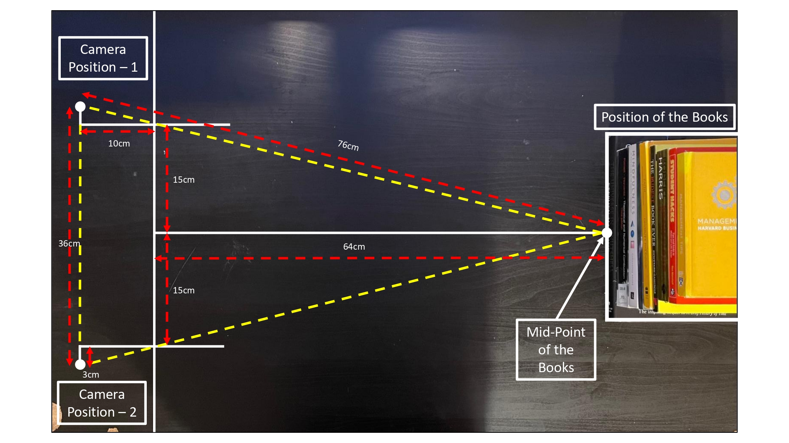

# From-Pixels-to-3D-Semi-Calibrated-Stereo-Reconstruction-and-Depth-Validation

## Image Capture Setup

This section documents the stereo image collection process for reconstructing 3D scene geometry using epipolar constraints.

---

### **Hardware**
- **Device Used:** iPhone 12 Pro Max  
- **Lens Used:** Main wide-angle lens (5.1 mm focal length)  
- **Image Format:** Captured in `.HEIC`, converted to `.JPG`  
- **Zoom Setting:** 1.5× (confirmed no lens switch; focal length from EXIF = 5.1 mm)  
- **Resolution:** 4032 × 3024 px  

---

### 🎯 **Scene Description**
- **Type of Scene:** High-texture, non-repetitive printed poster with ruler taped below for scale.  
- **Lighting:** Indoor, uniform lighting (no shadows or specularities).  
- **Texture Quality:** High (no repeating patterns).  
  

---

### **Stereo Geometry**
- **Number of Views:** 2  
- **Baseline Distance:** 36 cm  
- **Camera Orientation:** Both images taken with phones placed on a stand with mild angular offset (~10–15°).  
- **Object Distance from Camera:** ZZ cm *(center of scene)*  

---

### **Capture Method**
1. Two images captured from slightly different positions (left and right) to create disparity.  
2. Camera settings were not changed between shots—no zoom or exposure adjustments.  
3. Baseline and object distances were measured using a physical tape for ground truth depth comparison.

---

###  **Scene Schematic**
*Below is a schematic illustration of the stereo setup with all annotated distances.*

Citations:
1. https://support.apple.com/en-us/111874

## Steps
1. [Step 1: Data Collection](DataCollection.md)
2. [Step 2: Intrinsic Matrix Calculations](Intrinsic_matrix.md)

## ✅ Project To-Do: From Stereo Images to Depth Validation

-----

### 🟩 1. Stereo Pair Selection
- [ ] Detect SIFT (or ORB) features in all 10 × 10 stereo pairs.
- [ ] Match features and apply Lowe’s ratio test.
- [ ] Rank pairs by number of **inlier matches** (via `cv2.findFundamentalMat` + RANSAC).
- [ ] **Select the best left–right image pair** for reconstruction.

✅ *Outcome:* The best stereo pair for 3D processing.

---

### 🟩 2. Camera Intrinsics Preparation
- [ ] Use extracted EXIF focal length (5.1 mm) and sensor width to calculate **focal length in pixels**.
- [ ] Build the intrinsic matrix \( K \) using:

  \[
  K = 
  \begin{bmatrix}
  f_x & 0 & c_x \\\\
  0 & f_y & c_y \\\\
  0 & 0 & 1
  \end{bmatrix}
  \]

  with \( c_x = \text{image width}/2 \), \( c_y = \text{image height}/2 \)

✅ *Outcome:* Intrinsic matrix \(K\) for both images.

---

### 🟩 3. Estimate Fundamental and Essential Matrix
- [ ] Detect and match features for the selected pair.
- [ ] Estimate **Fundamental Matrix (F)** using RANSAC.
- [ ] Compute **Essential Matrix (E)** as \( E = K^\top F K \).
- [ ] Decompose \( E \rightarrow R, t \) (up to scale and ambiguity).
- [ ] Select the correct R, t using **cheirality check** (points must be in front of both cameras).

✅ *Outcome:* Complete stereo calibration — known intrinsics and extrinsics.

---

### 🟩 4. Dense Stereo Matching
- [ ] Rectify the selected stereo image pair (use \(R, t\), or `cv2.stereoRectify`).
- [ ] Compute **dense disparity map** using block matching or Semi-Global Matching (e.g., `cv2.StereoSGBM_create`).
- [ ] Visualize and normalize the disparity map.

✅ *Outcome:* Dense disparity map covering most of the image.

---

### 🟩 5. Depth Estimation
- [ ] Convert disparity \(d\) to depth \(Z\) using the formula:

  \[
  Z = \frac{f \cdot B}{d}
  \]

  where:
  - \(f\): focal length in pixels  
  - \(B\): baseline distance (in cm)  
  - \(d\): disparity value at a pixel

✅ *Outcome:* Per-pixel depth map (Z values).

---

### 🟩 6. Depth Validation
- [ ] Choose a clearly visible point in the image (e.g., a point on the ruler or center book).
- [ ] Annotate the corresponding pixel in the disparity map.
- [ ] Compute the estimated depth \(Z\) at that pixel.
- [ ] Compare with manually measured depth (e.g., 64 cm from schematic).
- [ ] Compute absolute error or percent error.

✅ *Outcome:* Quantitative validation of 3D reconstruction accuracy.

---

### 🟩 Optional (Bonus)
- [ ] Visualize the 3D point cloud using `cv2.reprojectImageTo3D()` or Open3D.
- [ ] Compute reprojection error by projecting triangulated points back into image space.

---

✅ This checklist ensures a full end-to-end stereo vision pipeline with measurable results and ground truth validation.
