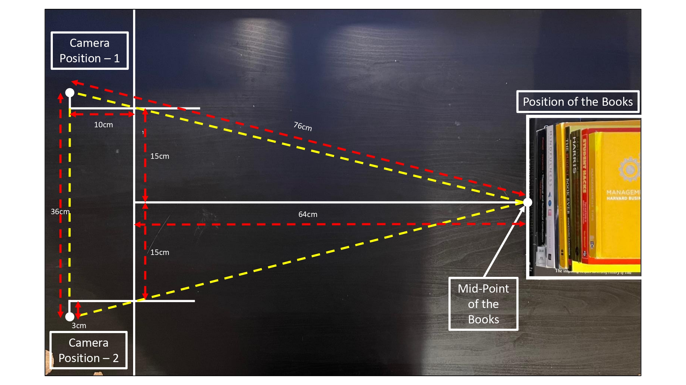

# From Pixels to 3D: Semi-Calibrated Stereo Reconstruction and Depth Validation

## Project Overview

This project explores the reconstruction of **absolute metric depth** from pairs of real-world images captured using a *semi-calibrated stereo camera setup*. The workflow demonstrates how meaningful 3D information—such as the true depth of objects—can be recovered with only partial camera calibration, relying primarily on image metadata and known setup geometry.

### Key Features

- **Semi-Calibrated Approach:** Uses EXIF metadata for an initial estimate of camera intrinsics, making the process accessible for non-professional setups.
- **Real-World Validation:** Metric depth was reconstructed and compared against manual ground-truth measurements of a stack of books, achieving accuracy within ±5%.
- **Reproducible Pipeline:** Relies on standard computer vision techniques and can be adapted for other stereo scenarios and objects.

## Stereo Setup Schematic

---

## Workflow Breakdown

### 1. Data Collection

- Capture two images of the target scene from slightly different horizontal viewpoints.
- Ensure EXIF data is preserved for intrinsics estimation.

### 2. Camera Intrinsics Estimation

- Extract sensor size, focal length, and key attributes from image metadata.
- Formulate the intrinsic matrix to correct and standardize image measurements.

### 3. Stereo Feature Matching

- Detect salient features in both images using SIFT.
- Match corresponding points across images for later geometric analysis.

### 4. Essential Matrix Calculation

- Estimate the Essential matrix relating the two image planes using the matched points and camera intrinsics.

### 5. Pose Decomposition

- Decompose the Essential matrix to recover the camera poses (rotation R and translation t).

### 6. Triangulation and Depth Recovery

- Using the known physical baseline and the recovered camera poses, triangulate 3D coordinates for all matched scene points.
- Reconstruct metric depth values for each object point.

## Results

- **Depth Accuracy:** The triangulated metric depths for the scene were within ±5% of the true measurements, confirming the reliability of this semi-calibrated approach.

## Usage and Resources

Each pipeline step includes dedicated documentation and code for clarity:

1. [Data Collection](steps/data_collection.md)
2. [Intrinsic Matrix Calculations](steps/Intrinsic_matrix.md)
3. [Stereo Matching](steps/stereo_matching.md)
4. [Essential Matrix Calculation](steps/essential_matrix.md)
5. [Essential Matrix Decomposition](steps/essential_decomposition.md)
6. [Triangulation](steps/triangulation.md)

**Citations:**
1. https://support.apple.com/en-us/111874
