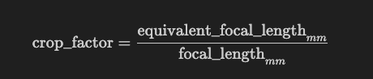

# Calculating the Camera Intrinsic Matrix from Image Metadata

## 1. Parse Image Metadata

- Load image metadata from a JSON or EXIF file.
- Extract the following fields:
  - **Image width** (pixels)
  - **Image height** (pixels)
  - **Focal length** (mm)
  - **35mm equivalent focal length** (mm)

## 2. Give and To find

- We have the physical Focal length, and we need th efocal length along x and y directions in pixels.
- This requires, sensor dimensions(width and height) (physical dimension) - these dimension are usually not mentioned in th specifications.
- hence we calculate the sensor dimensions from equivalent focal length and aspect ratio by first calulating crop factor, then sesor diagonal and then sensor width and height.
- using these sensor dimension we can calculate effective focal length in x and y direction in pixels!

## 3. Calculate Crop Factor

The crop factor is calculated as:

This determines how your sensor compares to a full-frame (35mm) sensor.

## 4. Estimate Sensor Size

Assume a full-frame diagonal of **43.3 mm** (standard for 35mm sensors).

Calculate the sensor diagonal:

For a 4:3 aspect ratio sensor:

## 5. Calculate Focal Length in Pixels

Convert the focal length from millimeters to pixels:

## 6. Set Principal Point

Assume the principal point is at the image center:

## 7. Construct the Intrinsic Matrix

The intrinsic matrix $K$ is:

## 8. Notes & Limitations

- **Aspect Ratio:** These calculations assume a 4:3 sensor from the aspect ratio of the images. (We split the sensor diagonal into 4:3 ratio!)
- **Metadata Accuracy:** The result depends on the accuracy of the metadata.
- **Principal Point:** The image center is a common assumption but may not be exact for all cameras.

### 🔍 Observation: Square Pixels

One key observation is that the computed focal lengths along the x and y axes (`f_x` and `f_y`) are nearly identical. This suggests that the image pixels are square in shape. Since the physical size of a pixel is the same in both the horizontal and vertical directions, the physical focal length is projected equally along both axes in pixel units, resulting in `f_x ≈ f_y`.

