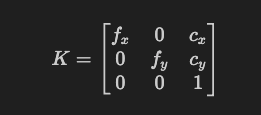
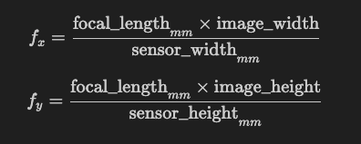
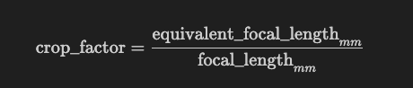
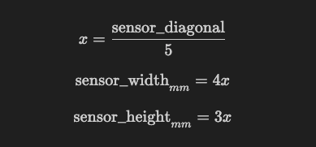
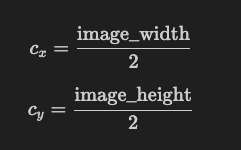

# Calculating the Camera Intrinsic Matrix from Image Metadata
To reconstruct 3D depth from stereo images, we first need the camera intrinsic matrix $K$

Where:
- $f_x$ , $f_y$ : focal lengths in pixels along x and y directions
- $c_x$ , $c_y$ : coordinates in pixels of the principle point (assumed to be at the image center)

## Challenge
Generally, the focal length provided in camera specifications or EXIF metadata is the 3D focal length in physical units (typically in millimeters). This focal length is the distance from the camera’s optical center to the image sensor, in 3D physical space.

However, for computer vision tasks like stereo reconstruction, we need the effective focal lengths in pixels, denoted by:
- $f_x = $ focal length in pixels along x-axis
- $f_y = $ focal length in pixels along y-axis

These are 2D projections of the 3D focal length, scaled according to the sensor dimensions and pixel density in each direction.

### How do they relate?

- $focal_{-}length_{mm}$ : Physical Focal length in mm
- $sensor_{-}width_{mm}$, $sensor_{-}height_{mm}$ : Sensor width and height in mm
- $image_{-}width$,$image_{-}height$: Image width and height in pixels

Challenge is that we do not know the sensor dimensions. So first we estimated the sensor dimensions and then calculate $f_x$ and $f_y$

## Solution

### 1. Parse Image Metadata

- Load image metadata from a JSON or EXIF file.
- Extract the following fields:
  - **Image width** (pixels)
  - **Image height** (pixels)
  - **Focal length** (mm)
  - **35mm equivalent focal length** (mm)

### 2. Give and To find

- We have the physical Focal length, and we need the focal length along x and y directions in pixels.
- This requires, sensor dimensions(width and height) (physical dimension) - these dimension are usually not mentioned in the specifications.
- Hence we calculate the sensor dimensions from equivalent focal length and aspect ratio by first calulating crop factor, then sensor diagonal and then sensor width and height.
- using these sensor dimension we can calculate effective focal length in x and y direction in pixels!

### 3. Calculate Crop Factor

The crop factor is calculated as:

This determines how your sensor compares to a full-frame (35mm) sensor.

### 4. Estimate Sensor Size

Assume a full-frame diagonal of **43.3 mm** (standard for 35mm sensors).

Calculate the sensor diagonal:

For a 4:3 aspect ratio sensor:

### 5. Calculate Focal Length in Pixels

Convert the focal length from millimeters to pixels:

### 6. Set Principal Point

Assume the principal point is at the image center:

### 7. Construct the Intrinsic Matrix

The intrinsic matrix $K$ is:

### 8. Notes & Limitations

- **Aspect Ratio:** These calculations assume a 4:3 sensor from the aspect ratio of the images. (We split the sensor diagonal into 4:3 ratio!)
- **Metadata Accuracy:** The result depends on the accuracy of the metadata.
- **Principal Point:** The image center is a common assumption but may not be exact for all cameras.

###  Observation: Square Pixels

One key observation is that the computed focal lengths along the x and y axes ($f_x$ and $f_y$) are nearly identical. This suggests that the image pixels are square in shape. Since the physical size of a pixel is the same in both the horizontal and vertical directions, the physical focal length is projected equally along both axes in pixel units, resulting in $f_x ≈ f_y$.

[Auxiliary Notes](auxiliary.md)