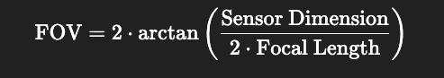

## What is Equivalent 35mm Focal Length?
The 35 mm equivalent focal length refers to the focal length a lens would need on a 35 mm full-frame sensor to produce the same field of view as the lens does on current camera.

We have two main components here: the lens and the sensor chip. The focal length is the distance from the lens to the image sensor when focused at infinity. The sensor captures the light and converts it into a digital image.

Now, while the focal length is fixed for a given lens, the field of view (FoV) — the extent of the observable world seen by the camera (measured in degrees) — depends on both the focal length and the sensor dimensions.

So if we take a given camera setup (with known sensor size, focal length, and FoV), and switch the sensor to a standard 35 mm full-frame sensor, then to maintain the same FoV, we would need to use a different focal length.

That focal length is what we refer to as the 35 mm equivalent focal length.

## Field of View
Field of View is the extent of the observable scene that a camera can capture in a single image.

FOV in angular range:

- Horizontal FOV (HFOV) - left to right
- Vertical FOV (VFOV) - top to bottom
- Diagonal FOV (DFOV) - corner to corner

## Crop Factor
Crop factor (also called as the focal length multiplier) is a ratio that describes how much smaller ("cropped") a camera sensor is compared to a full frame 35mm sensor.

Same value could be derived from ratio of diagonals of a full-frame camera to current camera. [We use this to our advantage to calculate the current camera diagonal to obtain sensor dimensions]

## Scalar Triple Product

## Skew Symmetric matrix of a vector

## Homogeneous Coordinates