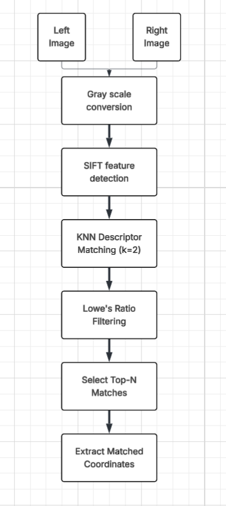

# Stereo Matching - Flow

### 1. Loading images and converting to grayscale
- Left and right images are loaded.
- Converted to grayscale because for SIFT grayscale is enough - we donot need color. Hence to save computation we convert images to grayscale.
### 2. Detect Keypoints & Descriptors using SIFT
- Apply SIFT to both the left and right images.
- We detect:
    - `Keypoints` : Location of distinctive image features. List of cv2.KeyPoint objects.
    - `Descriptors` : 128D feature vector describing each keypoint. Numpy array of dimension `(N,128)`

### 3. KNN Descriptor Matching (k=2)
- We use Brute-Force k-NN Matcher `BFMatcher.knnMatch` to find, for each descriptor in the left image, the top 2 best-matching descriptors in the right image based on Euclidean (L2) distance.
- Here descriptor `d1` from left image will have two matches from the right image:
    - `m` : lowest distance from `d1` (best match)
    - `n` : second lowest distance from `d1` (second best match)
- `matches` is a list of lists.
    - Each outer list element corresponds to one descriptor from the left image (des1).
    - Each inner list contains the top k matches (i.e., DMatch objects) from the right image (des2), sorted by distance.

### 4. Lowe’s Ratio Test for Filtering
- We apply Lowe’s ratio test to remove ambiguous matches.

- `if m.distance < ratio_thresh * n.distance:`   then we keep the match. [`m` and `n` are two matches we got from KNN]
- The rationale is: if the best and second-best are too close, the match is ambiguous and likely unreliable.
- `ratio_thres` has a value of 0.75

### 5.  Select Top-N Matches (By Distance)
- From the filtered "good" matches, we select the top-N ones with the lowest distances (i.e., best quality matches).
- Essentially, Top-N matches are the N descriptor pairs (one from the left image and one from the right image) that:
    - Passed Lowe's ratio test (i.e., are likely good/valid matches), and
    - Have the smallest L2 distances between their descriptors.

### 6. Extract Matched Coordinates
- Converts the list of matches into two N × 2 arrays containing pixel coordinates of matching points:
    - `pts1` from the left image.
    - `pts2` from the right image.

- `cv2.Dmatch` object has attriutes :
    - `queryIdx` : index of the matched keypoint in the left image
    - `trainIdx` : index of the matched keypoint in the right image
- We use these attribute to construct `pts1` and `pts2`
- `kpL[m.queryIdx].pt` → returns (x, y) coordinate of the keypoint in the left image, `kpL` is the list of `cv2.KeyPoint` we got after applying SIFT to the left image.
- Likewise for `kpR[m.trainIdx].pt` in the right image

- So, index `i` in both arrays corresponds to a matched pair of points between the left and right images.
    - `pts1[i]` is the (x, y) coordinate of a keypoint in the left image.
    - `pts2[i]` is the corresponding (x, y) coordinate of the matching keypoint in the right image.

